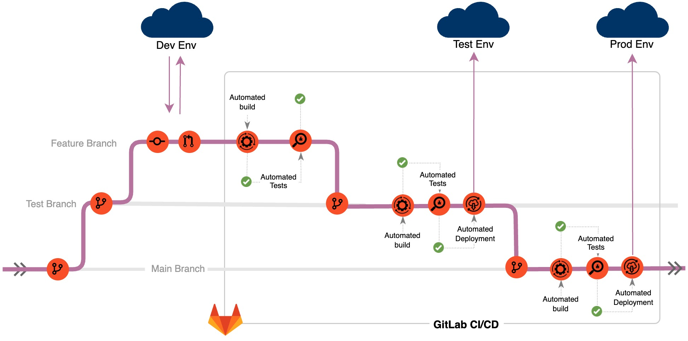

# Contributing to HollerithEnergyML

This document provides guidelines to help you understand how you can contribute in different roles and make a valuable impact.


## How to Contribute

Contributions to **HollerithEnergyML** can be made in several ways:
1. **Data Scientists & Engineers**: Improve and enhance ML models.
2. **Frontend & Backend Developers**: Develop and refine the user interface and server-side applications.
3. **DevOps Experts**: Maintain and improve Docker configurations, CI/CD pipelines, and cloud integrations.

## Branching Strategy

Our project employs a structured branching strategy to facilitate a smooth development and deployment process for all contributors, including Developers, Data Scientists, and DevOps.

### General Workflow

- **main**: The primary branch reflecting a production-ready state.
- **test/x.y.z**: is a long living branch for the test environment.
- **feature/xyz**: Branch off from `test branch` for new features or enhancements.
- **bugfix/xyz**: For bug fixes, branch off from `main branch`.
<br></br>

 <center>**Figure1:** Git Flow with GitLab CI/CD</center>


### Contribution as Frontend & Backend Developer

**1. Clone the Repository**
Start by cloning this repository to your local machine:
```bash
git clone https://gitlab.reutlingen-university.de/schulza/ml_recommender_system.git

cd <repository-directory>
```

**2. Choose or create your Feature Branch**
Create a new Feature branch for your task:
```bash
git checkout -b feature/my-feature
```

Make sure you're on your Feature branch before making any changes:
```bash
git branch
```
**3. Develop ;)**

- If your make Frontend adaptions use `ng`
```bash
ng build
ng serve
ng test
```
- If you make Backend adaptions unse a `Python env`
```bash
cd BAckend
python -m venv myenv
source myenv/bin/activate
pip install  requirements.txt

#For Tests run your Uint Tests from Backen/tests/test-units.py
cd tests

# Also pytest can be used if everything is correctly crated by naming conevtions vrom pytest
python test-units.py
```

**4. Commit & Push your work**
- Commit your changes to your Feature branch as needed:
```bash
git commit -m "Your descriptive commit message here"
```
- Push your Feature branch to the remote repository:
```bash
git push origin feature/my-feature"
```

**5. Create a Merge Request**
When your feature is complete or you're ready for review, create a Merge Request,. The Request will be reviewed and, if approved, merged into the Release Branch.

### Contribution as Data Scientist

Data Scientists working with notebooks and MLflow integrated in GitLab should:

- Branch off from `main` for experimental models and analytics.
- Use the naming convention `ml/your_model_name` for clarity.
- Ensure that notebook experiments and MLflow tracking are in sync with the branch.
- Once experiments are finalized and models are ready, create a merge request to `FeatureXY`, afterwards the Backend has to be adopted with new Endpoints, if not done via the CI/CD Pipeline.


## Development and Release Process

1. **Starting with Feature Development**:
   - As a Developer, branch off from `test` to `feature/your_feature_name`.
   - Data Scientists should branch off to `ml/your_model_name`.

2. **Local Development and Testing**:
   - Develop and test your features or models locally.
   - Commit and push your changes to the respective feature or ML branch.

3. **Continuous Integration**:
   - Upon pushing your code, CI pipelines will automatically build Docker images and run unit/integration tests.
   - For Data Scientists, ensure your MLflow experiments align with your branch.

4. **Creating Merge Requests**:
   - After successful tests and completion of feature/model development, create a Merge Request to the `test` branch.

5. **Deployment**:
   - The Continuous Deployment pipeline handle deployment to the Test Environment.
   - Developers and Data Scientists do not need to interact directly with Release branches during feature/model development.

6. **Final Prod Deployment**:
   - Once the Test branch has been thoroughly tested in the Testing Environment and Code Review is done, it is merged into `main`.
   - The final deployment is then carried out to the Production Environment by the Continuous Delivery Pipeline.

### Additional Notes

- **Code Review**: All Merge Requests to `main` require thorough code reviews to maintain code quality and project integrity.
- **CI/CD**: Familiarize yourself with our CI/CD processes presented in the `.gitlab-ci.yml` file, as they are integral to our workflow.
