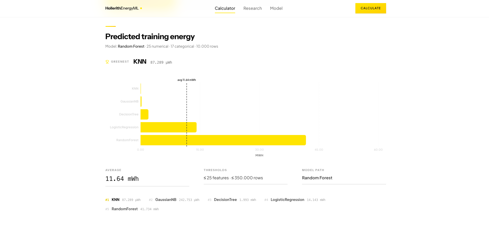

# HollerithEnergyML

> Predict the energy consumption of ML model training before you train.

[](https://github.com/lukasgro63/hollerithengeryml/actions/workflows/ci.yml)




## What it does

Three numbers in. Five algorithms ranked by predicted training energy out.
No training, no GPU, no waiting. Pick the greenest option for your data
shape before you spend the watts.

Powered by a meta-model trained at the
[Herman Hollerith Zentrum](https://www.hhz.de), Reutlingen University, on
real CodeCarbon measurements across DecisionTree, GaussianNB, KNN,
LogisticRegression, and RandomForest.

## Quickstart

```bash
git clone https://github.com/lukasgro63/hollerithengeryml.git
cd hollerithengeryml
docker compose -f infra/docker-compose.yml up --build
```

Then open <http://localhost:3000>.

## Documentation

The full handbook lives in [`docs/`](./docs/):

- **[Architecture](./docs/ARCHITECTURE.md)** — runtime topology, API contract, security posture
- **[Model card](./docs/MODEL_CARD.md)** — meta-model details, training data, limitations
- **[Runbook](./docs/RUNBOOK.md)** — deploys, rollbacks, incident response
- **[Contributing](./docs/CONTRIBUTING.md)** — dev workflow, commit conventions, release flow
- **[Research](./research/README.md)** — archived 2024 baseline campaign

## License

[MIT](./LICENSE) © 2024–2026 HollerithEnergyML contributors

Herman Hollerith Zentrum · Reutlingen University
