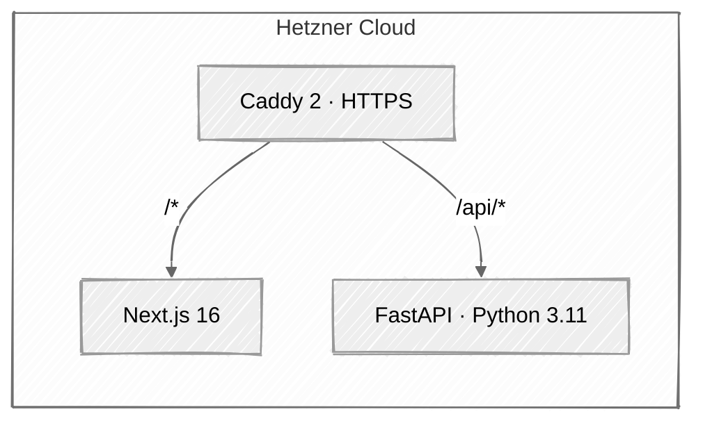

# HollerithEnergyML

> **Predict the energy consumption of ML model training before you train.**

Estimate how much electrical energy (in kWh) a scikit-learn training run will
consume — given only the shape of your dataset. Powered by a meta-model trained
on a controlled baseline campaign at the
[Herman Hollerith Zentrum](https://www.hhz.de), Reutlingen University.

[](https://github.com/lukasgro63/hollerithengeryml/actions/workflows/ci.yml)


---

## How it works

1. The user supplies three inputs: number of numerical features, number of
   categorical features, and total dataset size.
2. A meta-model (a scikit-learn regressor trained on CodeCarbon measurements
   across a baseline of classical algorithms) predicts the energy consumption
   of training five classical algorithms on that input shape:
   DecisionTree, GaussianNB, KNN, LogisticRegression, RandomForest.
3. The webapp visualises the comparison so users can pick a greener algorithm
   before they even start training.

The research foundation — which factors affect training energy, how the
baseline was measured, what datasets were used — is archived under
[`research/`](./research/).

## Architecture



See [`docs/ARCHITECTURE.md`](./docs/ARCHITECTURE.md) for the full architectural
blueprint, API contract, and deployment topology.

## Project structure

```
apps/
├── api/          FastAPI backend (Python 3.11, scikit-learn 1.2.2)
└── web/          Next.js 16 frontend (React 19, Tailwind CSS 4)
infra/            Docker Compose, Caddy, deployment scripts
research/         Archived baseline-test notebooks and raw research data
docs/             Architecture, Model Card, Runbook, Contributing
```

## Quickstart (local development)

Spin up both services locally with one command:

```bash
git clone https://github.com/lukasgro63/hollerithengeryml.git
cd hollerithengeryml
docker compose -f infra/docker-compose.yml up --build
```

The api comes up on `http://localhost:8000` and the web on
`http://localhost:3000`.

For focused single-service development without Docker, run each app
directly:

```bash
# Backend
cd apps/api
uv sync
uv run uvicorn hollerith_api.main:app --reload

# Frontend
cd apps/web
npm install
npm run dev
```

## Tech stack

| Layer       | Technology                                          |
|-------------|-----------------------------------------------------|
| Frontend    | Next.js 16 · React 19 · TypeScript · Tailwind CSS 4 |
| UI kit      | lucide-react · Recharts · clsx + tailwind-merge     |
| Forms       | react-hook-form · zod                               |
| Backend     | FastAPI 0.115 · Python 3.11 · Pydantic v2           |
| ML runtime  | scikit-learn 1.2.2 (pinned) · joblib                |
| Tooling     | uv · ruff · pytest                                  |
| Container   | Docker · Docker Compose v2                          |
| Proxy       | Caddy 2 (automatic HTTPS)                           |
| Hosting     | Hetzner Cloud (Nuremberg)                           |
| CI/CD       | GitHub Actions · ghcr.io                            |

## Model preservation

The production meta-model lives at
[`apps/api/models/ml_model_package.pkl`](./apps/api/models/). It was trained
in 2024 and is **not** retrained as part of this rebuild. We pin
`scikit-learn==1.2.2` to guarantee joblib-load compatibility across Python
versions.

See [`docs/MODEL_CARD.md`](./docs/MODEL_CARD.md) for model details, training
methodology, intended use, and known limitations.

## Self-hosting

HollerithEnergyML is designed to self-host on a small Hetzner Cloud VPS
(CX22 in Nuremberg is the reference target) behind Caddy with automatic
HTTPS. The full Docker Compose stack, the Caddyfile, and the host
provisioning and deploy scripts live under [`infra/`](./infra/). For the
operational playbook — first-time setup, deploys, rollbacks, log access,
TLS rotation, and incident response — see
[`docs/RUNBOOK.md`](./docs/RUNBOOK.md).

## Documentation

- [`docs/ARCHITECTURE.md`](./docs/ARCHITECTURE.md) — runtime topology, API contract, security posture
- [`docs/MODEL_CARD.md`](./docs/MODEL_CARD.md) — meta-model details, training data, known limitations
- [`docs/RUNBOOK.md`](./docs/RUNBOOK.md) — first-time setup, deploys, rollbacks, incident response
- [`docs/CONTRIBUTING.md`](./docs/CONTRIBUTING.md) — dev workflow and code style
- [`SECURITY.md`](./SECURITY.md) — responsible disclosure policy
- [`CHANGELOG.md`](./CHANGELOG.md) — release history
- [`CODE_OF_CONDUCT.md`](./CODE_OF_CONDUCT.md) — community norms
- [`research/README.md`](./research/README.md) — archived 2024 baseline campaign

## Contributing

Read [`docs/CONTRIBUTING.md`](./docs/CONTRIBUTING.md) before opening pull
requests. Run `make setup` to install dependencies and pre-commit hooks,
then `make check` to verify everything passes locally.

## License

[MIT](./LICENSE) © 2024–2026 HollerithEnergyML contributors.

Herman Hollerith Zentrum · Reutlingen University
