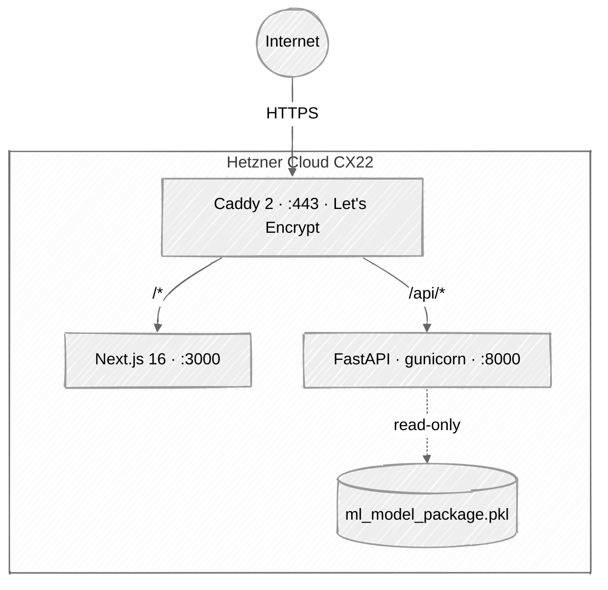
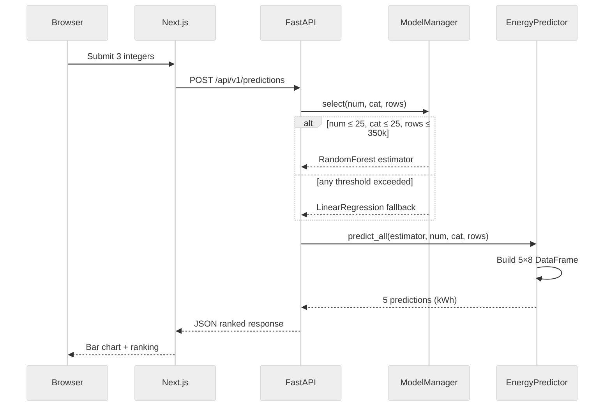
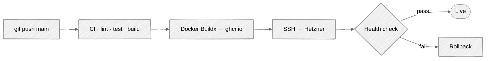

# Architecture

## Goals

HollerithEnergyML is a single-feature web application: take three integers
describing a machine learning dataset shape, return predicted energy
consumption (in kWh) for training each of five classical scikit-learn
algorithms on data of that shape.

**Non-goals:** authentication, multi-tenancy, persisting user data, retraining
the meta-model.

## Monorepo layout

```
apps/
├── api/   FastAPI service, loads the scikit-learn meta-model from disk
└── web/   Next.js 16 site with a client-side calculator component
infra/     Docker Compose, Caddy reverse proxy, Hetzner provisioning
research/  Archived research artefacts (see research/README.md)
docs/      Architecture, Model Card, Runbook, Contributing
```

## Runtime topology



## Prediction flow



## API contract (v1)

```
POST /api/v1/predictions
Content-Type: application/json

Request:
{
  "num_numerical_features":   int [1, 10_000],
  "num_categorical_features": int [0, 10_000],
  "dataset_size":             int [1, 100_000_000]
}

Response 200:
{
  "predictions": [
    {"algorithm": "RandomForest",       "energy_kwh": 0.000035, "rank": 1},
    {"algorithm": "LogisticRegression", "energy_kwh": 0.000012, "rank": 2},
    {"algorithm": "DecisionTree",       "energy_kwh": 0.000002, "rank": 3},
    {"algorithm": "KNN",                "energy_kwh": 0.0000004, "rank": 4},
    {"algorithm": "GaussianNB",         "energy_kwh": 0.0000002, "rank": 5}
  ],
  "average_kwh": 0.0000099,
  "model_used": "random_forest",
  "thresholds_applied": { "num_features": 25, "cat_features": 25, "dataset_size": 350000 },
  "out_of_training_range": false
}

GET /api/v1/health
  → { "status": "ok", "model_loaded": true, "version": "1.0.0" }

GET /api/v1/metadata
  → { "version": "1.0.0", "sklearn_version": "1.2.2",
      "algorithms": [...], "feature_names": [...],
      "thresholds": { "max_numerical_features": 25, ... },
      "model_path": "ml_model_package.pkl" }
```

**Model-selection rule** (inherited from the 2024 deployed codebase):
`num_numerical_features ≤ 25` AND `num_categorical_features ≤ 25` AND
`dataset_size ≤ 350_000` → RandomForest meta-model; otherwise the linear
fallback.

## CI/CD pipeline



## Technology choices

| Concern        | Choice                    | Alternative considered       |
|----------------|---------------------------|------------------------------|
| Web framework  | Next.js 16 (App Router)   | Astro 5, SvelteKit 2         |
| UI             | Custom components + Tailwind 4 | Angular Material, DaisyUI |
| Forms          | react-hook-form + zod     | Formik, native HTML          |
| Charts         | Recharts                  | Visx, Chart.js               |
| Backend        | FastAPI 0.135             | Litestar, Flask              |
| Validation     | Pydantic v2               | marshmallow                  |
| Python tooling | uv + ruff                 | poetry + black/flake8        |
| Container      | Docker + Compose v2       | Podman, Kubernetes           |
| Proxy/TLS      | Caddy 2                   | Traefik, Nginx               |
| Hosting        | Hetzner Cloud             | Fly.io, Railway              |
| CI/CD          | GitHub Actions + ghcr.io  | GitLab CI, CircleCI          |

## Security posture

- HTTPS only — Caddy auto-renews Let's Encrypt certificates.
- HSTS with `preload`, strict CSP, `X-Frame-Options: DENY`,
  `Referrer-Policy: strict-origin-when-cross-origin`, `Permissions-Policy`
  locking out camera, microphone, geolocation.
- CORS allowlist — no wildcards.
- Pydantic v2 bounded inputs to prevent resource exhaustion.
- Rate limiting on `/api/v1/predictions` (slowapi).
- Docker containers run as a non-root user with a read-only root filesystem.
- The joblib-serialised model is loaded from an immutable model volume at
  startup only — never from user input — to neutralise the
  deserialisation-RCE attack surface.
- Secrets live in `/etc/hollerith/.env` (chmod 600) on the host, outside git.
- Dependency scanning via Dependabot.

## What lives where

| Concern                  | File                              |
|--------------------------|-----------------------------------|
| Local dev stack          | `infra/docker-compose.yml`        |
| Production stack         | `infra/docker-compose.prod.yml`   |
| Reverse proxy + HTTPS    | `infra/Caddyfile`                 |
| One-time host bootstrap  | `infra/deploy/provision.sh`       |
| CI-triggered deploy      | `infra/deploy/deploy.sh`          |
| CI checks                | `.github/workflows/ci.yml`        |
| Build, push, deploy      | `.github/workflows/deploy.yml`    |
| Dependency updates        | `.github/dependabot.yml`          |
