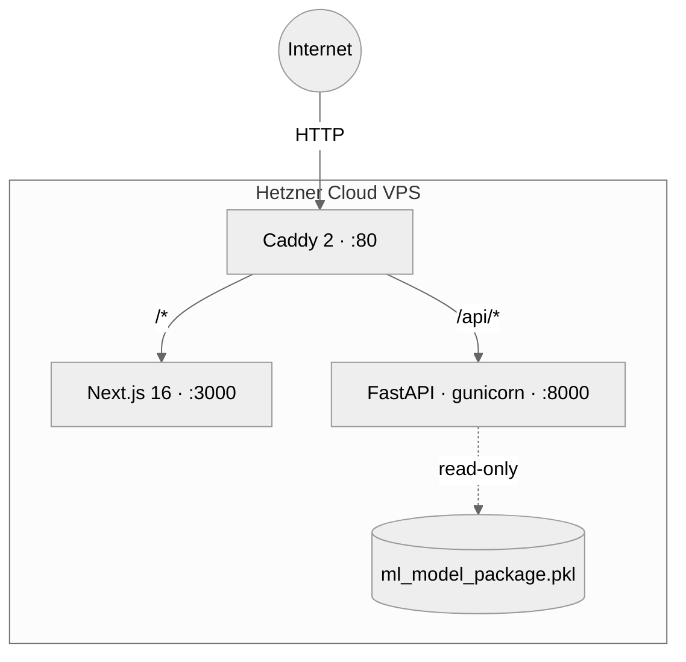
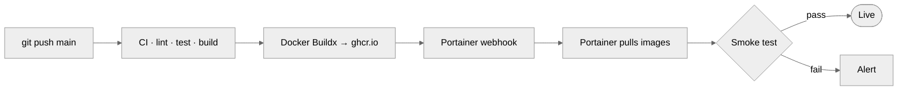

# Architecture

## Goals

HollerithEnergyML is a single-feature web application: take three integers
describing a machine learning dataset shape, return the predicted
training-energy share — as an integer 0–100 normalised to the
highest-consuming algorithm — for each of five classical scikit-learn
algorithms on data of that shape.

**Non-goals:** authentication, multi-tenancy, persisting user data, retraining
the meta-model.

## Monorepo layout

```
apps/
├── api/   FastAPI service, loads the scikit-learn meta-model from disk
└── web/   Next.js 16 site with a client-side calculator component
infra/     Docker Compose, Caddy reverse proxy, Hetzner provisioning
research/  Archived research artefacts (see research/README.md)
docs/      Architecture, Model Card, Runbook, Contributing
```

## Runtime topology



Production currently runs on a public IPv4 without a domain, so Caddy
serves plain HTTP. Adding a domain is a one-line change in the Caddyfile
(`:80` → `example.de`) — Caddy then provisions a Let's Encrypt
certificate automatically on next restart.

## Prediction flow


## API contract (v1)

```
POST /api/v1/predictions
Content-Type: application/json

Request:
{
  "num_numerical_features":   int [1, 10_000],
  "num_categorical_features": int [0, 10_000],
  "dataset_size":             int [1, 100_000_000]
}

Response 200:
{
  "predictions": [
    {"algorithm": "RandomForest",       "energy_percent": 100, "rank": 1},
    {"algorithm": "LogisticRegression", "energy_percent":  34, "rank": 2},
    {"algorithm": "DecisionTree",       "energy_percent":   5, "rank": 3},
    {"algorithm": "KNN",                "energy_percent":   1, "rank": 4},
    {"algorithm": "GaussianNB",         "energy_percent":   0, "rank": 5}
  ],
  "model_used": "random_forest",
  "thresholds_applied": { "num_features": 25, "cat_features": 25, "dataset_size": 350000 },
  "out_of_training_range": false
}

`energy_percent` is the integer share (0–100) of each algorithm's predicted
training energy relative to the highest-consuming algorithm in the same
response. The rank-1 entry is always exactly `100`. The meta-model still
predicts in kilowatt-hours internally; the public API normalises to keep
the comparison resolution-independent.

GET /api/v1/health
  → { "status": "ok", "model_loaded": true, "version": "1.0.0" }

GET /api/v1/metadata
  → { "version": "1.0.0", "sklearn_version": "1.2.2",
      "algorithms": [...], "feature_names": [...],
      "thresholds": { "max_numerical_features": 25, ... },
      "model_path": "ml_model_package.pkl" }
```

**Model-selection rule** (inherited from the 2024 deployed codebase):
`num_numerical_features ≤ 25` AND `num_categorical_features ≤ 25` AND
`dataset_size ≤ 350_000` → RandomForest meta-model; otherwise the linear
fallback.

## CI/CD pipeline



No SSH involved: GitHub Actions only calls a webhook URL. Portainer
reconciles the stack from the Git repository and pulls new images from
`ghcr.io`. See `infra/README.md` for the full flow.

## Technology choices

| Concern        | Choice                    | Alternative considered       |
|----------------|---------------------------|------------------------------|
| Web framework  | Next.js 16 (App Router)   | Astro 5, SvelteKit 2         |
| UI             | Custom components + Tailwind 4 | Angular Material, DaisyUI |
| Forms          | react-hook-form + zod     | Formik, native HTML          |
| Charts         | Recharts                  | Visx, Chart.js               |
| Backend        | FastAPI 0.135             | Litestar, Flask              |
| Validation     | Pydantic v2               | marshmallow                  |
| Python tooling | uv + ruff                 | poetry + black/flake8        |
| Container      | Docker + Compose v2       | Podman, Kubernetes           |
| Proxy/TLS      | Caddy 2                   | Traefik, Nginx               |
| Hosting        | Hetzner Cloud             | Fly.io, Railway              |
| CI/CD          | GitHub Actions + ghcr.io  | GitLab CI, CircleCI          |

## Security posture

- **Transport**: HTTP on port 80. No HTTPS until a domain is assigned;
  the Caddyfile will auto-provision Let's Encrypt once a hostname
  replaces the `:80` listener.
- **Headers**: `X-Content-Type-Options: nosniff`, `X-Frame-Options:
  SAMEORIGIN`, `Referrer-Policy: strict-origin-when-cross-origin`,
  `Permissions-Policy` locking out camera/microphone/geolocation —
  all applied by Caddy for every response.
- **CORS**: explicit allowlist, no wildcards.
- **Input validation**: Pydantic v2 with bounded integer ranges prevents
  resource exhaustion.
- **Rate limiting**: slowapi (30 requests per minute per IP on the
  predictions endpoint).
- **Container hardening**: api runs read-only with `tmpfs /tmp`, web
  runs as non-root, Caddy publishes only port 80.
- **Model loading**: joblib artefact loaded once at startup from the
  image layer — never from user input — so deserialisation-RCE is
  off the table at request time.
- **Pinned dependencies**: runtime versions match the 2024 training
  environment exactly so the serialised model loads deterministically.

## What lives where

| Concern                  | File                                       |
|--------------------------|--------------------------------------------|
| Local dev stack          | `infra/docker-compose.yml`                 |
| Production stack         | `infra/docker-compose.prod.yml`            |
| Reverse proxy            | `infra/Caddyfile`                          |
| CI checks (code)         | `.github/workflows/ci.yml`                 |
| CI checks (docs no-op)   | `.github/workflows/ci-docs.yml`            |
| Build, push, deploy      | `.github/workflows/deploy.yml`             |
| Auto changelog + tags    | `.github/workflows/release-please.yml`     |
