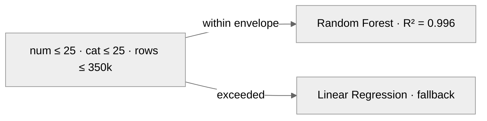

# Model Card — HollerithEnergyML Meta-Model

## Model details

- **Artefact:** `apps/api/models/ml_model_package.pkl`
- **Type:** joblib-serialised tuple `(linear_regression_model, random_forest_regressor)`
- **Framework:** scikit-learn 1.2.2
- **Trained:** 2024-01, Herman Hollerith Zentrum, Reutlingen University
- **Serialisation:** joblib

## Intended use

Predicts the energy consumption (in kWh) of training one of five classical
scikit-learn algorithms on a tabular dataset of a given shape. Intended as a
**decision-support tool** for students and researchers evaluating algorithm
choice for their training workloads.

## Input features (8)

| Index | Name                   | Type  | Notes            |
|-------|------------------------|-------|------------------|
| 0     | `num_num_features`     | float | Raw count        |
| 1     | `num_cat_features`     | float | Raw count        |
| 2     | `number_of_instances`  | float | Number of rows   |
| 3     | `model_0`             | float | DecisionTree     |
| 4     | `model_1`             | float | GaussianNB       |
| 5     | `model_2`             | float | KNN              |
| 6     | `model_3`             | float | LogisticRegression |
| 7     | `model_4`             | float | RandomForest     |

## Model-selection rule

| Condition                                                                   | Model used        |
|-----------------------------------------------------------------------------|-------------------|
| `num_num ≤ 25` AND `num_cat ≤ 25` AND `dataset_size ≤ 350_000`              | Random Forest     |
| Otherwise                                                                   | Linear Regression |

## Output

Single float: predicted training energy in kWh (can be sub-kWh, displayed in
Wh / mWh / µWh depending on magnitude).

## Training data

See [`../research/README.md`](../research/README.md) for the archived
baseline campaign: CodeCarbon measurements on Diabetes, Bank Marketing, and
Heart 2020 datasets across the five algorithms.

## Known limitations

1. **Hardware-calibrated.** The baseline was measured on a dual-core Intel
   Xeon at 2.20 GHz with 12.6 GB of RAM running Linux (Python 3.10.12).
   Training on different CPU architectures (Apple Silicon, AMD, ARM
   servers) or on a GPU will deviate — sometimes by an order of magnitude
   — from these predictions. Treat the output as a reference value
   anchored to that one machine, not a universal physical estimate.
2. **Default hyperparameters only.** Every measurement was taken with
   scikit-learn 1.2.2 default hyperparameters across all five classifiers.
   Custom hyperparameters — Random Forest tree depth and `n_estimators`,
   KNN `n_neighbors`, LogisticRegression regularisation strength,
   DecisionTree max depth — are invisible to the meta-model and will shift
   real energy consumption in ways the predictions do not capture.
3. **Linear extrapolation beyond the envelope.** Inputs larger than 25
   numerical features, 25 categorical features, or 350,000 rows fall
   through to the LinearRegression fallback, which is exactly a linear
   extrapolation of the measured surface. Treat large-data predictions as
   rough directional guidance, not precise estimates.
4. **No XGBoost.** The original 2024 campaign did measure XGBoost
   alongside the five scikit-learn classifiers, but it was excluded from
   the production meta-model for scikit-learn-API consistency. If you need
   an XGBoost estimate, this model will not give you one.
5. **Small-data sparsity.** The training set is thin for very small
   datasets (under a few hundred rows). Predictions in that regime carry
   more uncertainty than the average error rate suggests.

## Maintenance

- `scikit-learn==1.2.2` is pinned to guarantee joblib-load compatibility.
- If the model is retrained, update this card and regenerate the artefact.
- Consider exporting to ONNX in a future phase for language-agnostic serving
  and to eliminate the deserialisation-RCE attack surface entirely.
